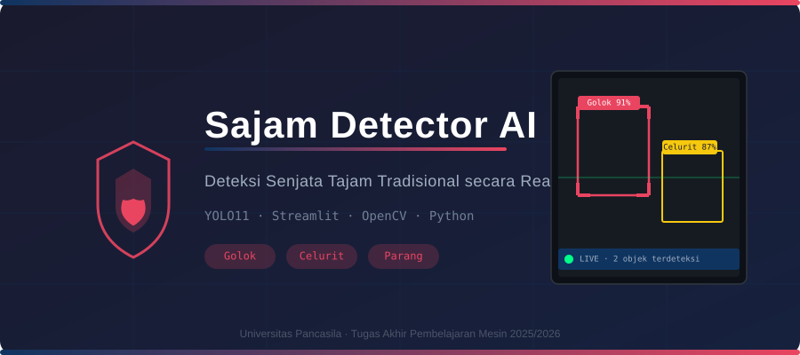

<div align="center">



# 🛡️ Sajam Detector AI

### Deteksi Senjata Tajam Tradisional secara *Real-Time* dengan Deep Learning

[](https://www.python.org/)
[](https://streamlit.io/)
[](https://ultralytics.com/)
[](LICENSE)

---

[🚀 Jalankan Lokal](#-instalasi) · [📁 Lihat Model](best.pt) · [🐛 Laporkan Bug](https://github.com/Boas04/Sajam-Detector-AI/issues/new?template=bug_report.yml) · [💡 Usulkan Fitur](https://github.com/Boas04/Sajam-Detector-AI/issues/new?template=feature_request.yml)

</div>

---

## 📌 Tentang Proyek

**Sajam Detector AI** adalah aplikasi *computer vision* berbasis web yang dirancang untuk mendeteksi **senjata tajam tradisional Indonesia** — *Golok*, *Celurit*, dan *Parang* — secara *real-time* melalui kamera, menggunakan model **YOLOv11** yang telah dilatih khusus.

Proyek ini dibangun sebagai **Tugas Akhir Mata Kuliah Pembelajaran Mesin** di Program Studi Teknik Informatika, Universitas Pancasila (2025/2026), dengan fokus pada pemanfaatan AI untuk mendukung keamanan lingkungan publik.

> 📷 **Screenshot & Demo Video** — *Segera hadir. Kontributor dapat menambahkan `docs/assets/demo.gif` dan memperbarui bagian ini.*

---

## ✨ Fitur Unggulan

| Fitur | Deskripsi |
|-------|-----------|
| 🎯 **Real-Time Detection** | Deteksi langsung dari webcam dengan latensi rendah |
| 🏷️ **Multi-Class** | Mendukung tiga kelas: Golok, Celurit, Parang |
| 📊 **Confidence Score** | Menampilkan tingkat keyakinan model untuk setiap deteksi |
| ⚠️ **Visual Alert** | Border merah & indikator bahaya otomatis saat objek terdeteksi |
| 🎚️ **Adjustable Threshold** | Slider untuk mengatur sensitivitas deteksi dari sidebar |
| 🖥️ **UI Modern** | Antarmuka profesional berbasis Streamlit dengan custom CSS |

---

## 🛠️ Teknologi

| Komponen | Teknologi | Versi |
|----------|-----------|-------|
| **Bahasa** | Python | 3.8+ |
| **UI Framework** | Streamlit | 1.28+ |
| **Object Detection** | Ultralytics YOLO (YOLOv11) | 8.0+ |
| **Computer Vision** | OpenCV | 4.8+ |
| **Image Processing** | Pillow | 10.0+ |
| **Numerik** | NumPy | 1.24+ |

---

## ⚙️ Cara Kerja

```
┌─────────────┐     ┌──────────────┐     ┌────────────────┐     ┌──────────────────┐
│  Webcam 📷  │────▶│  OpenCV      │────▶│  YOLO11 Model  │────▶│  Streamlit UI    │
│  (frame)    │     │  (pre-proses)│     │  (best.pt)     │     │  (bounding box,  │
└─────────────┘     └──────────────┘     └────────────────┘     │   label, score)  │
                                                                  └──────────────────┘
```

1. **Webcam** menangkap frame video secara langsung.
2. **OpenCV** melakukan pre-processing pada setiap frame.
3. **Model YOLO11** (`best.pt`) memproses frame dan menghasilkan prediksi.
4. **Streamlit** merender hasil deteksi berupa *bounding box*, label kelas, dan *confidence score*.
5. Sistem memberikan **visual alert** (border merah) jika senjata tajam terdeteksi.

---

## 🚀 Instalasi

### Prasyarat

- Python **3.8** atau lebih baru
- **Webcam** aktif (built-in atau eksternal)
- Git

### Langkah Instalasi

```bash
# 1. Clone repository
git clone https://github.com/Boas04/Sajam-Detector-AI.git
cd Sajam-Detector-AI

# 2. (Disarankan) Buat virtual environment
python -m venv .venv
source .venv/bin/activate      # Linux / macOS
# .venv\Scripts\activate       # Windows

# 3. Instal dependensi
pip install -r requirements.txt
```

---

## ▶️ Menjalankan Aplikasi

```bash
streamlit run Main.py
```

Kemudian buka browser dan akses: **`http://localhost:8501`**

> **Windows shortcut:** Klik dua kali `run.bat`

### Penggunaan

1. Klik checkbox **🔴 Aktifkan Kamera**
2. Arahkan objek (atau simulasi gambar) ke kamera
3. Sistem akan mendeteksi dan menampilkan prediksi secara otomatis
4. Atur **Confidence Threshold** di sidebar untuk menyesuaikan sensitivitas

---

## 🗂️ Struktur Proyek

```
Sajam-Detector-AI/
├── Main.py                  # Entrypoint utama aplikasi Streamlit
├── best.pt                  # Bobot model YOLO11 hasil training
├── run.bat                  # Shortcut Windows untuk menjalankan aplikasi
├── requirements.txt         # Daftar dependensi Python
├── LICENSE                  # MIT License
├── README.md                # Dokumentasi utama
├── docs/
│   └── assets/
│       └── hero.svg         # Banner hero README
└── .github/
    ├── workflows/
    │   └── lint.yml         # GitHub Actions: Python linting
    ├── ISSUE_TEMPLATE/
    │   ├── bug_report.yml
    │   └── feature_request.yml
    └── PULL_REQUEST_TEMPLATE.md
```

---

## 💡 Tips Pemakaian

> 💡 **Pencahayaan** — Pastikan pencahayaan ruangan cukup terang untuk hasil deteksi yang optimal.

> ⚡ **Confidence Threshold** — Mulai dengan nilai **0.5** (default). Turunkan jika ingin deteksi lebih sensitif; naikkan untuk mengurangi false positive.

> 🖥️ **Performa** — Jika frame rate lambat, coba tutup aplikasi lain yang berat. GPU opsional tetapi meningkatkan kecepatan inferensi.

> 📦 **Model** — File `best.pt` adalah bobot khusus yang dilatih pada dataset senjata tajam tradisional Indonesia. Jangan diganti sembarangan.

---

## 🗺️ Roadmap

- [x] Deteksi real-time via webcam (Golok, Celurit, Parang)
- [x] Antarmuka Streamlit dengan custom styling
- [x] Confidence threshold yang dapat disesuaikan
- [x] Visual alert saat bahaya terdeteksi
- [ ] 📸 Demo GIF / screenshot aplikasi
- [ ] 🎬 Video demo YouTube
- [ ] 📊 Halaman laporan performa model (mAP, precision, recall)
- [ ] 🌐 Dukungan input video file (`.mp4`)
- [ ] 🐳 Docker support untuk deployment mudah
- [ ] 📱 Optimasi untuk Raspberry Pi / edge device

---

## 👨‍💻 Tim Developer

> **Universitas Pancasila** · Teknik Informatika · 2025/2026

| No | Nama | NIM |
|----|------|-----|
| 1 | Abner Boas P. P. Gultom | 4523210002 |
| 2 | Andika Haikal Syahputra | 4523210016 |
| 3 | Fajar Istiqomah | 4523210045 |
| 4 | Mesak Mychart E. Purba | 4523210062 |
| 5 | Khalissa Raihanah Azhari | 4523210122 |

---

## 🤝 Kontribusi

Kontribusi sangat kami sambut! Silakan baca [CONTRIBUTING.md](CONTRIBUTING.md) untuk panduan lengkap.

1. Fork repo ini
2. Buat branch: `git checkout -b feat/fitur-baru`
3. Commit: `git commit -m "feat: tambahkan fitur baru"`
4. Push & buka Pull Request

---

## 📄 Lisensi

Proyek ini dilisensikan di bawah **MIT License** — lihat file [LICENSE](LICENSE) untuk detail.

---

<div align="center">

Dibuat dengan ❤️ oleh Tim Sajam Detector AI · Universitas Pancasila

⭐ Jika proyek ini bermanfaat, berikan bintang di GitHub!

</div>
